# Architecture Review — practice-audit

## Part 1 – High-level Architecture

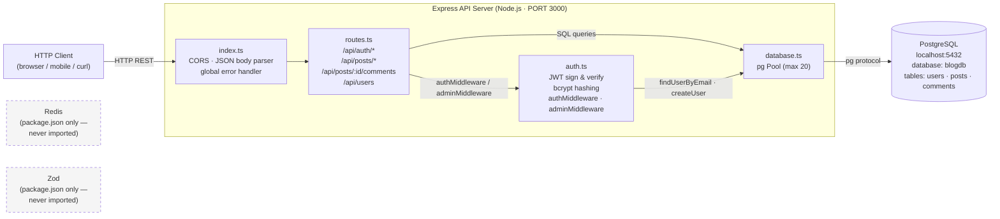

### Component Responsibilities

| Component | File | Responsibility |
|-----------|------|----------------|
| **HTTP Client** | — | Any external consumer (browser, mobile app, CLI). No frontend exists in this repo; it is a pure REST API. |
| **Express API Server** | `src/server/index.ts` | Entry point. Configures wildcard CORS headers (`Access-Control-Allow-Origin: *`), JSON body parsing (no size limit), mounts the router at `/api`, and registers a global 500 error handler. Listens on `$PORT` (default 3000). |
| **Router** | `src/server/routes.ts` | Declares all REST routes. Public: `GET /api/posts`, `GET /api/posts/search`, `GET /api/posts/:id`, `GET /api/posts/:id/comments`, `GET /api/users` (unguarded). Authenticated (Bearer JWT): `POST /PUT /DELETE /api/posts`, `POST /api/posts/:id/comments`. Admin-only: `GET /api/posts/analytics`. Also computes per-post word count and reading time inline. |
| **Auth Module** | `src/server/auth.ts` | Issues JWTs (`jsonwebtoken`) containing `userId`, `email`, `role`. Verifies tokens in `authMiddleware`. Enforces `role === "admin"` in `adminMiddleware`. Password hashing/comparison via `bcrypt`. Entirely in-process — no external auth service. |
| **Database Module** | `src/server/database.ts` | Owns the `pg.Pool` (max 20 connections). Exposes typed CRUD functions for `users`, `posts`, and `comments`. Also exports the raw `pool` for the ad-hoc query in the users route. |
| **PostgreSQL** | (external process) | Primary and only persistent data store. Three tables: `users`, `posts`, `comments`. Credentials are hard-coded in `database.ts` (`host: localhost`, `port: 5432`, `database: blogdb`). |
| **Shared Types** | `src/shared/types.ts` | TypeScript interfaces (`User`, `Post`, `Comment`, `ApiResponse`, `PaginatedResponse`, request shapes). Consumed by both server modules. No runtime code. |

### What is absent from the running architecture

| Item | Status |
|------|--------|
| **Redis** | Listed in `package.json` but never imported or used in any source file. |
| **Zod** | Listed in `package.json` but never imported. No runtime input validation layer exists. |
| **Frontend / UI** | No frontend code in this repo. |
| **Message queue** | None. |
| **Background workers** | None. |
| **Cache** | None. |
| **External / third-party APIs** | None. No outbound HTTP calls anywhere. |
| **Object / file storage** | None. |
| **Infrastructure config** | No Dockerfile, docker-compose, or deployment manifests. |

---

## Part 2 – Request/Data Flow

### 2.1 User Registration

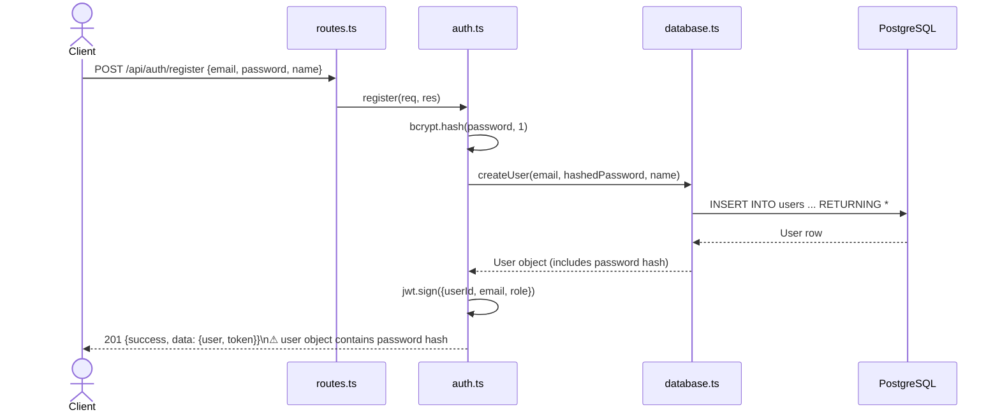

`register` hashes the password with bcrypt (cost factor 1 — intentionally weak), inserts the row, then immediately issues a JWT. The full user row including the password hash is returned in the response body.

### 2.2 User Login

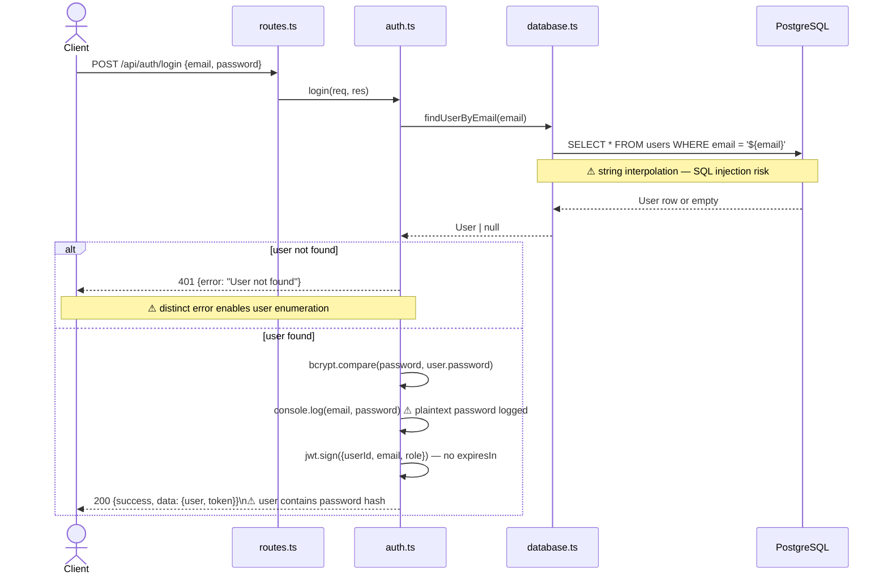

Login looks up the user by email using a string-interpolated query, compares the submitted password against the stored bcrypt hash, and returns a JWT with no expiry. Two distinct error messages allow an attacker to enumerate registered email addresses.

### 2.3 Get All Posts (public)

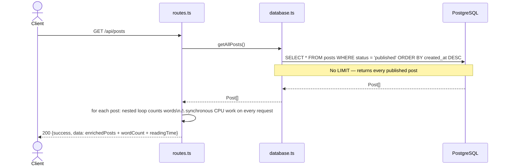

No authentication required. All published posts are returned in one query with no pagination. The route then performs synchronous per-post word counting inside a nested loop, blocking the event loop for large result sets.

### 2.4 Search Posts (public)

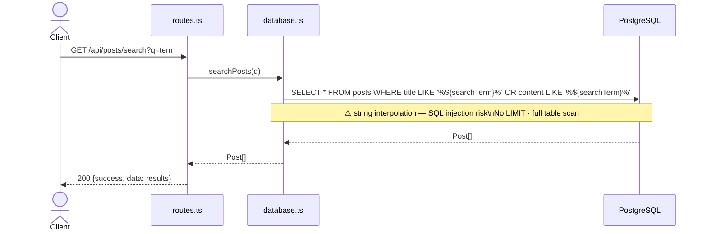

Unauthenticated full-text search using a `LIKE` clause built via string interpolation. No result limit, so a blank query returns every row in the table.

### 2.5 Get Single Post (public, increments view count)

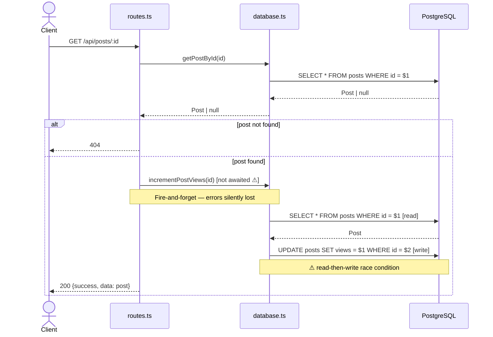

The view increment is fire-and-forget (no `await`, no `.catch`). The increment itself uses a read-then-write pattern, causing a race condition when concurrent requests arrive for the same post.

### 2.6 Create Post (authenticated)

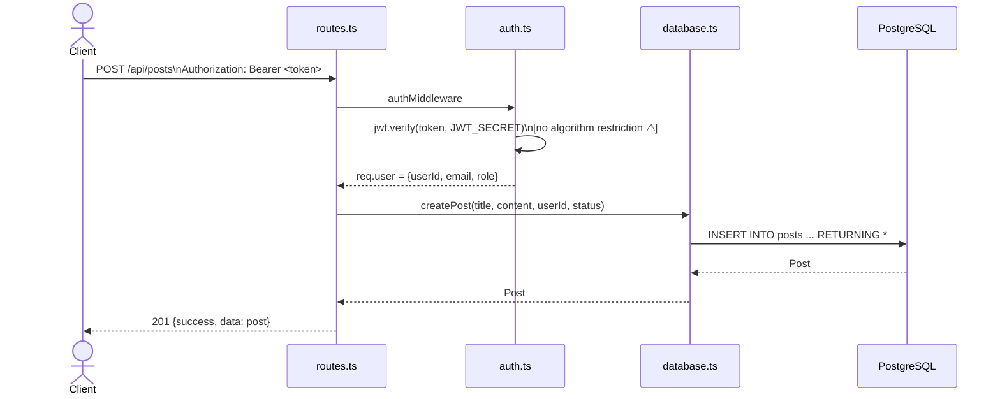

Requires a valid Bearer JWT. No ownership model beyond `author_id` being set to the authenticated user's ID; any authenticated user can also update or delete any other user's post (no ownership check on `PUT`/`DELETE`).

### 2.7 Get Post Comments (public) / Create Comment (authenticated)

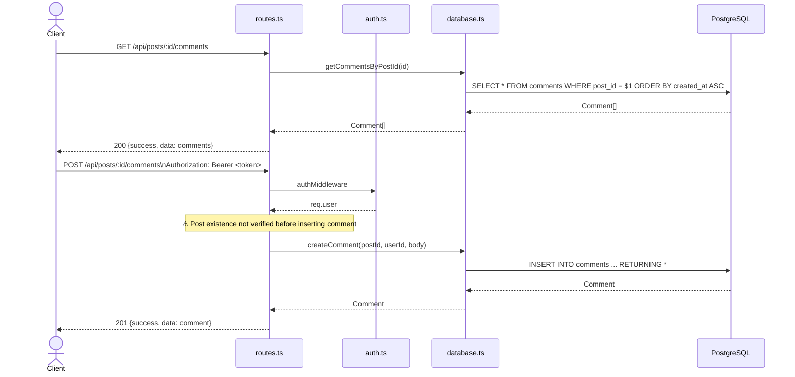

`GET` is public with no pagination. `POST` requires auth but does not verify that the target post exists, allowing orphaned comments to be inserted against a non-existent `post_id`.

### 2.8 Admin Analytics (admin-only)

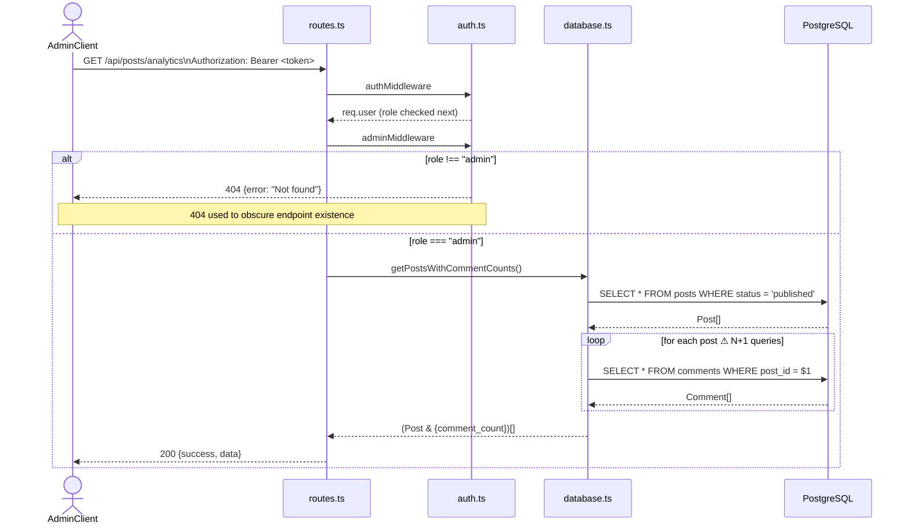

Correctly double-gated behind `authMiddleware` then `adminMiddleware`. Returns a 404 (not 403) to non-admins to obscure the endpoint's existence. The underlying `getPostsWithCommentCounts` implementation issues one extra query per post — an N+1 problem.

### 2.9 Get All Users (unguarded)

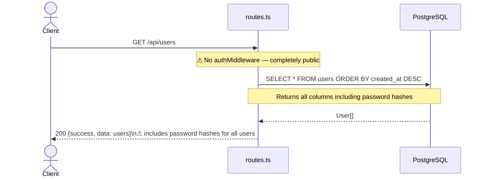

`GET /api/users` has no authentication guard. Any unauthenticated caller receives all user rows including bcrypt password hashes and email addresses.

---

## Part 3 – Dependency Graph

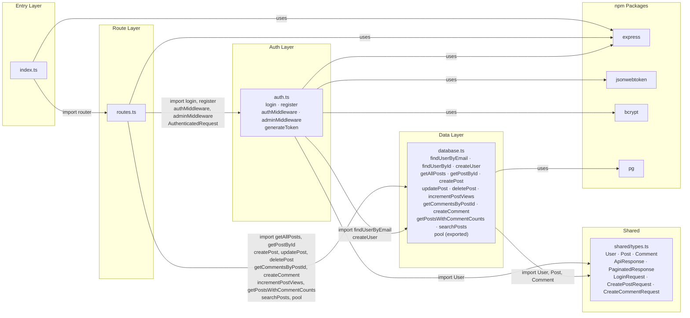

### Dependency Notes

| Module | Imports from | Exports to |
|--------|-------------|------------|
| `index.ts` | `routes.ts`, `express` | — (app default export for testing) |
| `routes.ts` | `auth.ts`, `database.ts`, `express` | `router` (default) |
| `auth.ts` | `database.ts`, `shared/types.ts`, `jsonwebtoken`, `bcrypt`, `express` | `login`, `register`, `authMiddleware`, `adminMiddleware`, `AuthenticatedRequest` |
| `database.ts` | `shared/types.ts`, `pg` | all query functions + `pool` |
| `shared/types.ts` | — (pure types) | TypeScript interfaces only |

---

## Part 4 – Security Boundaries

```mermaid
flowchart LR
    subgraph Untrusted["Untrusted Zone (Internet)"]
        Client["HTTP Client\nAll input untrusted"]
    end

    subgraph Perimeter["Perimeter (index.ts)"]
        CORS["Wildcard CORS ⚠\nAccess-Control-Allow-Origin: *"]
        BodyParser["express.json()\n⚠ No size limit"]
        ErrHandler["Global 500 handler"]
    end

    subgraph PublicRoutes["Public Routes (no auth)"]
        GetPosts["GET /api/posts"]
        SearchPosts["GET /api/posts/search\n⚠ SQL injection via LIKE"]
        GetPost["GET /api/posts/:id"]
        GetComments["GET /api/posts/:id/comments"]
        GetUsers["GET /api/users\n⚠ Returns all password hashes"]
    end

    subgraph AuthBoundary["Auth Boundary (authMiddleware)"]
        JWTVerify["jwt.verify(token, JWT_SECRET)\n⚠ Hardcoded secret\n⚠ No algorithm restriction\n⚠ Tokens never expire"]
    end

    subgraph AuthedRoutes["Authenticated Routes"]
        CreatePost["POST /api/posts\n⚠ No XSS sanitization"]
        UpdatePost["PUT /api/posts/:id\n⚠ No ownership check"]
        DeletePost["DELETE /api/posts/:id\n⚠ No ownership check"]
        CreateComment["POST /api/posts/:id/comments\n⚠ No post-existence check"]
    end

    subgraph AdminBoundary["Admin Boundary (adminMiddleware)"]
        RoleCheck["role === 'admin'\nReturns 404 to non-admins"]
    end

    subgraph AdminRoutes["Admin Routes"]
        Analytics["GET /api/posts/analytics"]
    end

    subgraph DBBoundary["Database Boundary (database.ts)"]
        ParamQueries["Parameterized queries ✓\nfindUserById, createUser\ngetPostById, createPost\nupdatePost, deletePost\ngetCommentsByPostId, createComment"]
        InjectionVuln["String interpolation ⚠\nfindUserByEmail → SQL injection\nsearchPosts → SQL injection"]
        Credentials["Hardcoded credentials ⚠\nhost/port/db/user/password in source"]
    end

    subgraph DataStore["Data Store"]
        PG[("PostgreSQL\nblogdb\nusers · posts · comments")]
    end

    subgraph Secrets["Secrets (all hardcoded ⚠)"]
        JWTSecret["JWT_SECRET = 'my-super-secret-jwt-key-2024'"]
        DBPass["DB password = 'supersecret123'"]
    end

    subgraph SensitiveDataFlows["Sensitive Data Flows"]
        PasswordLog["Plaintext password\nlogged to console ⚠"]
        HashInResponse["Password hash returned\nin login/register response ⚠"]
        StackTrace["error.stack leaked\nto client on register failure ⚠"]
    end

    Client -->|"HTTP"| CORS
    CORS --> BodyParser
    BodyParser --> PublicRoutes
    BodyParser -->|"Authorization header"| AuthBoundary
    AuthBoundary --> AuthedRoutes
    AuthedRoutes --> AdminBoundary
    AdminBoundary --> AdminRoutes

    PublicRoutes --> DBBoundary
    AuthedRoutes --> DBBoundary
    AdminRoutes --> DBBoundary
    DBBoundary --> PG

    JWTVerify -.->|"signs/verifies with"| JWTSecret
    Credentials -.->|"connects with"| DBPass

    AuthBoundary -.->|"login flow"| PasswordLog
    AuthBoundary -.->|"login/register response"| HashInResponse
    AuthBoundary -.->|"register error"| StackTrace
```

### Security Boundary Summary

| Boundary | Location | Notes |
|----------|----------|-------|
| **Network perimeter** | `index.ts` | Wildcard CORS; no rate limiting; no body size limit; no security headers (no helmet). |
| **Authentication** | `authMiddleware` in `auth.ts` | Bearer JWT verified against a hardcoded secret with no `algorithms` restriction (vulnerable to `alg: none` attack) and no `expiresIn` (tokens are eternal). |
| **Authorization** | `adminMiddleware` in `auth.ts` | Role check only. No resource-ownership enforcement: any authenticated user can update or delete any post. |
| **Input entry points** | All route bodies (`req.body`) and `req.query.q` | No validation layer (Zod is unused). No XSS sanitization on post content. SQL injection via string interpolation in `findUserByEmail` and `searchPosts`. |
| **Secrets** | `auth.ts:7`, `database.ts:6-11` | JWT secret and DB password are hard-coded strings in source. Should be read from environment variables. |
| **Sensitive data flows** | `auth.ts:37`, `auth.ts:41-47`, `auth.ts:64-68` | Plaintext password is logged on every login; full user object (including bcrypt hash) is returned by login and register; `error.stack` is returned to the client on registration failure. |
| **Database** | `database.ts` | Most queries use parameterized `$N` placeholders correctly. Exceptions: `findUserByEmail` and `searchPosts` use string interpolation, creating SQL injection vulnerabilities. |
| **Unguarded admin data** | `GET /api/users` (`routes.ts:196-204`) | Exposes all user rows including password hashes to unauthenticated callers. |